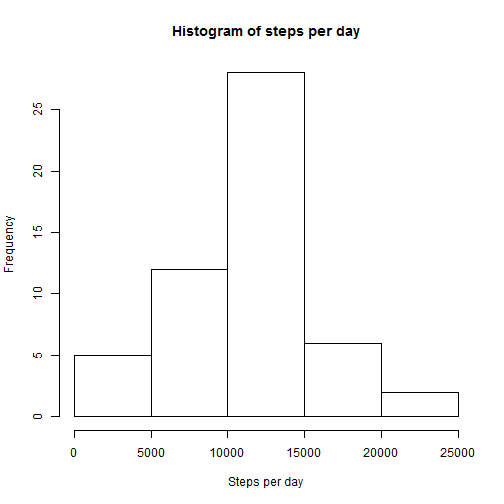
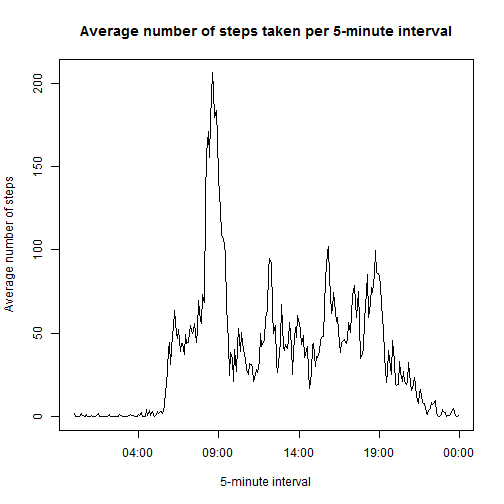
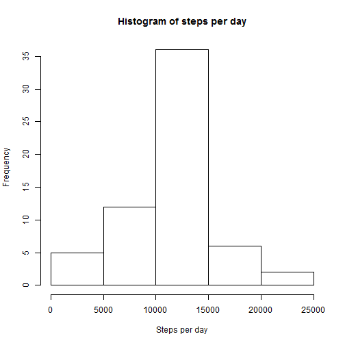

# Reproducible Research: Peer Assessment 1


## Loading and preprocessing the data


```r
activity<-read.csv("activity.csv", na.strings = "NA", colClasses=c("integer", "Date", "integer"))

activity$datetime<-strptime(paste(activity$date, sprintf("%04d", activity$interval)), "%Y-%m-%d %H%M")
```
head(activity)


## What is mean total number of steps taken per day?

```r
Stepsperday <- aggregate(steps~date, data=activity, sum)  
hist(Stepsperday$steps, main="Histogram of steps per day", xlab = "Steps per day")
```

 

```r
stepsperday.mean<-mean(Stepsperday$steps)
stepsperday.median<-median(Stepsperday$steps)
```
The mean value of the total number of steps taken per day is 1.0766 &times; 10<sup>4</sup>.

The median value of the total number of steps taken per day is 10765.


## What is the average daily activity pattern?

```r
activity$timeoftheday <- strptime(sprintf("%04d", activity$interval), "%H%M")
library(plyr)
meanbytimeoftheday <- ddply(activity, .(timeoftheday), summarize, mean = mean(steps, na.rm = TRUE))
plot(meanbytimeoftheday$timeoftheday, meanbytimeoftheday$mean, type="l", main="Average number of steps taken per 5-minute interval", xlab="5-minute interval", ylab="Average number of steps")
```

 

```r
maxsteps<-round(max(meanbytimeoftheday$mean),2)
maxinterval<-meanbytimeoftheday$timeoftheday[which.max(meanbytimeoftheday$mean)]
maxinterval.nodate<-strftime(maxinterval, "%H:%M")
```

The maximum number of steps on average across all the days in the dataset is 206.17 and it occurs at 08:35.
    
## Imputing missing values
**Description of a strategy for imputing missing data:** I will replace the missing values with the mean of the interval

```r
na <- is.na(activity$steps) 
sum(na)
```

```
## [1] 2304
```

```r
filledactivity<-activity
for (i in which(is.na(filledactivity$steps))) {
filledactivity$steps[i]<-meanbytimeoftheday$mean[(meanbytimeoftheday$timeoftheday==filledactivity$timeoftheday[i])]
}
filledstepsperday <- aggregate(steps~date, data=filledactivity, sum)  
hist(filledstepsperday$steps, main="Histogram of steps per day", xlab = "Steps per day")
```

 

```r
filledstepsperday.mean<-mean(filledstepsperday$steps)
filledstepsperday.median<-median(filledstepsperday$steps)
```
The mean value of the total number of steps taken per day is 1.0766 &times; 10<sup>4</sup>. The mean value is the same as before imputation.

The median value of the total number of steps taken per day is 1.0766 &times; 10<sup>4</sup>. The median value has changed after imputation.


## Are there differences in activity patterns between weekdays and weekends?

```r
filledactivity$weekend<-rep(0, length(filledactivity$date))
filledactivity$weekend[(as.POSIXlt(filledactivity$date)$wday==0 | as.POSIXlt(filledactivity$date)$wday==6)]<-1
weekdayactivity<-subset(filledactivity, weekend==0)
weekendactivity<-subset(filledactivity, weekend==1)
meanweekend <- ddply(weekendactivity, .(interval), summarize, mean = mean(steps, na.rm = TRUE), weekend=1)
meanweekday <- ddply(weekdayactivity, .(interval), summarize, mean = mean(steps, na.rm = TRUE), weekend=0)
mean2<-rbind(meanweekend, meanweekday)
mean2$weekend <- factor(mean2$weekend, labels = c("weekday", "weekend"))
library(lattice)
xyplot(mean ~ interval | weekend, data=mean2, type="l", xlab="Interval", ylab="Number of steps", layout = c(1, 2)) ## Plot with 2 panels
```

 
